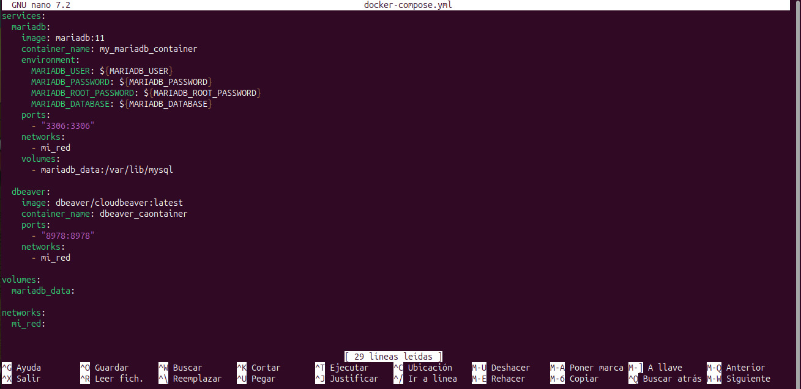
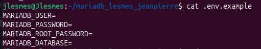
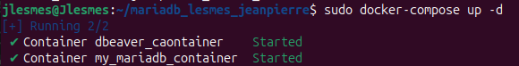
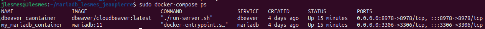
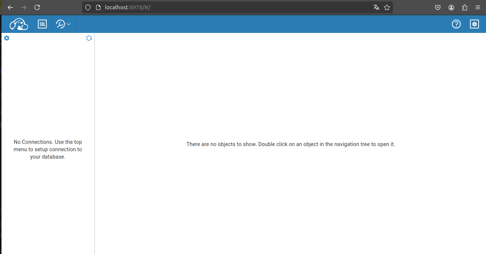
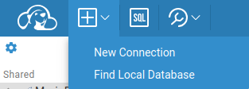
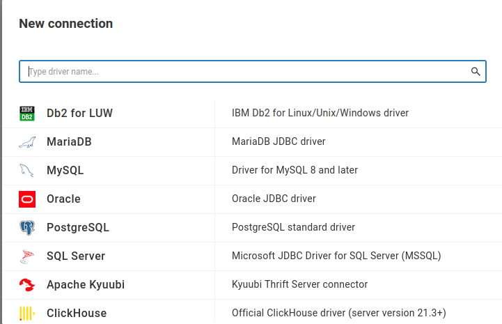
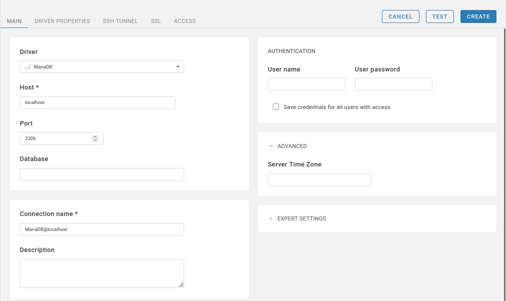
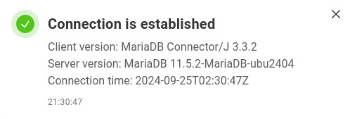
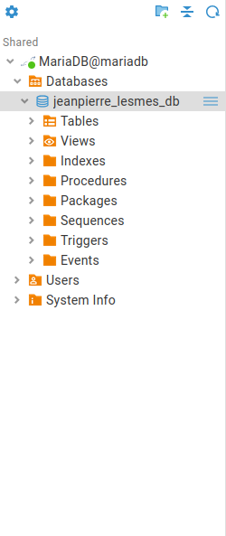

Autor: Jeanpierre David Lesmes Pedraza

Objetivo: Entender e implementar el cliente dbeaver y el contenedor mariadb utilizando docker compose y conectarlo con la base de datos de mariadb.

# Configuracion dbeaver y mariadb con Docker Compose

A continuacion se va a definir el archivo `docker-compose.yml` para conectar una base de datos de mariadb en dbeaver

## 1. Crear el directorio del proyecto

Creamos el proyecto mariadb_lesmes_jeanpierre

``` bash
mkdir mariadb_lesmes_jeanpierre
```

Luego accedemos al proyecto para poder navegar en el.

```bash
cd mariadb_lesmes_jeanpierre
```

## 2. Crear archivo `docker-compose.yml`

Dentro del directotio creamos el archivo `docker-compose.yml` y lo abrimos para editarlo.

```bash
nano docker-compose.yml
```

## 3. Definir los servicios de dbeaver y mariadb

Dentro del archivo `docker-compose.yml` vamos a hacer la siguiente configuracion.

```yml
services:
  mariadb:
    image: mariadb:11
    container_name: my_mariadb_container
    environment:
      MARIADB_USER: ${MARIADB_USER}
      MARIADB_PASSWORD: ${MARIADB_PASSWORD}
      MARIADB_ROOT_PASSWORD: ${MARIADB_ROOT_PASSWORD}
      MARIADB_DATABASE: ${MARIADB_DATABASE}
    ports:
      - "3306:3306"
    networks:
      - mi_red
    volumes:
      - mariadb_data:/var/lib/mysql

  dbeaver:
    image: dbeaver/cloudbeaver:latest
    container_name: dbeaver_caontainer
    ports:
      - "8978:8978"
    networks:
      - mi_red

volumes:
  mariadb_data:

networks:
  mi_red:
```



En esta configuracion se utilizaron las variables de entorno:
- MARIADB_USER: La cual define el nombre de usuario con el que se va acceder a la base de datos
- MARIADB_PASSWORD: Define la contraseña del usuario especificado.
- MARIADB_ROOT_PASSWORD: Es la contraseña del usuario ROOT, el cual es el administrador principal de la base de datos
- MARIADB_DATABASE: Define el nombre de la base de datos que se creara.

Se configuro la red `networks` para conectar los servicios de mariadb y dbeaver

## 4. Definir variables de entorno

Crear un archivo `.env` en el mismo archivo `docker-compose.yml`

```bash
MARIADB_USER= my_user
MARIADB_PASSWORD= my_password
MARIADB_ROOT_PASSWORD= my_root_password
MARIADB_DATABASE= my_database
```
Cambiar el valor de `my` por los valores de su gusto



## 5. Iniciar servicio

Para iniciar el servicio, en el directorio donde se encuentra el archivo `docker-compose.yml` ejecuta

```bash
docker-compose up -d
```



## 6. Verificacion de ejecucion

Se verifica que los contenedores esten en ejecucion

```bash
docker-compose ps
```



# Conexion al cliente

## 1. Acceder dbeaver a traves del navegador

Abrir el navegador y en la barra de busqueda ponemos `localhost:8978` o el puerto que haya configurado e inicie sesion



## 2. Conexion a base de datos

- click en New Connection

    

- Selecciona el gestor de bases de datos en este caso `MariaDB`

    

- Proporciene los datos necesarios los cuales son las variables de entorno anteriormente configuradas

    

- Luego testea la conexion

    

- Click en create, proporcione los datos para iniciar la conexion y ya podra navegar dentro de su base de datos

    
