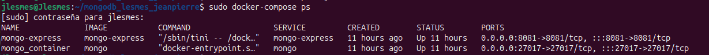

Autor: Jeanpierre David Lesmes Pedraza

Objetivo: Entender e implementar el cliente mongo-express y el contenedor mongodb utilizando docker compose y conectarlo con la base de datos de mongodb.

# Configuracion mongo-express y mongodb con Docker Compose

A continuacion se va a definir el archivo `docker-compose.yml` para conectar una base de datos de mongodb en mongo-express

## 1. Crear el directorio del proyecto

Creamos el proyecto mongodb_lesmes_jeanpierre

``` bash
mkdir mongodb_lesmes_jeanpierre
```

Luego accedemos al proyecto para poder navegar en el.

```bash
cd mongodb_lesmes_jeanpierre
```

## 2. Crear archivo `docker-compose.yml`

Dentro del directotio `mongodb_lesmes_jeanpierre`, creamos el archivo `docker-compose.yml` y lo abrimos para editarlo.

```bash
nano docker-compose.yml
```

## 3. Definir los servicios de mongo-express y mongodb

Dentro del archivo `docker-compose.yml` vamos a hacer la siguiente configuracion.
```yml
services:
  mongo:
    image: mongo
    container_name: mongo_container
    restart: always
    environment:
      MONGO_INITDB_ROOT_USERNAME: ${MONGO_INITDB_ROOT_USERNAME}
      MONGO_INITDB_ROOT_PASSWORD: ${MONGO_INITDB_ROOT_PASSWORD}
      MONGO_INITDB_DATABASE: ${MONGO_INITDB_DATABASE}
    volumes:
      - ./mongo-volume:/data/db
    ports:
      - "27017:27017"

  mongo-express:
    image: mongo-express
    container_name: mongo-express
    restart: always
    environment:
      ME_CONFIG_MONGODB_SERVER: ${ME_CONFIG_MONGODB_SERVER}
      ME_CONFIG_MONGODB_ADMINUSERNAME: ${ME_CONFIG_MONGODB_ADMINUSERNAME}
      ME_CONFIG_MONGODB_ADMINPASSWORD: ${ME_CONFIG_MONGODB_ADMINPASSWORD}
      ME_CONFIG_BASICAUTH_USERNAME: ${ME_CONFIG_BASICAUTH_USERNAME}
      ME_CONFIG_BASICAUTH_PASSWORD: ${ME_CONFIG_BASICAUTH_PASSWORD}
    ports:
      - "8081:8081"

networks:
  default:
    name: mongodb_network
```


En esta configuracion se utilizaron las variables de entorno:
- MONGO_INITDB_ROOT_USERNAME= Define el nombre de usuario ROOT el cual es el administrador de la base de datos.
- MONGO_INITDB_ROOT_PASSWORD= Define la contraseña para el usuario ROOT
- MONGO_INITDB_DATABASE= Define el nombre de la base de datos que se creara.
- ME_CONFIG_MONGODB_SERVER= Especifica la direccion del servidor al que mongo-express se conectara.
- ME_CONFIG_MONGODB_ADMINUSERNAME= Define el usuario administrativo para mongo-express.
- ME_CONFIG_MONGODB_ADMINPASSWORD= Define la contraseña para el usuario administrativo.
- ME_CONFIG_BASICAUTH_USERNAME= Define el usuario para la autenticacion basica en mongo-express
- ME_CONFIG_BASICAUTH_PASSWORD= Define la contraseña para el usuario para la autenticacion basica en mongo express.

Se configuro la red `networks` para conectar los servicios de mariadb y dbeaver

## 4. Definir variables de entorno

Crear un archivo `.env` en el mismo archivo `docker-compose.yml`

```bash
MONGO_INITDB_ROOT_USERNAME= my_user
MONGO_INITDB_ROOT_PASSWORD= my_password
MONGO_INITDB_DATABASE= my_database

ME_CONFIG_MONGODB_SERVER= my_server
ME_CONFIG_MONGODB_ADMINUSERNAME= my_adminuser
ME_CONFIG_MONGODB_ADMINPASSWORD= my_password
ME_CONFIG_BASICAUTH_USERNAME= my_user
ME_CONFIG_BASICAUTH_PASSWORD= my_password
```
Cambiar el valor de `my` por los valores de su gusto


## 5. Iniciar servicio

Para iniciar el servicio, en el directorio donde se encuentra el archivo `docker-compose.yml` ejecuta

```bash
docker-compose up -d
```


## 6. Verificacion de ejecucion

Se verifica que los contenedores esten en ejecucion

```bash
docker-compose ps
```



# Conexion al cliente

## 1. Acceder dbeaver a traves del navegador

Abrir el navegador y en la barra de busqueda ponemos `localhost:8081` o el puerto que haya configurado e inicie sesion.


luego de iniciar sesion entrara a mongo-express.


## 2. Conexion base de datos

- proporcione el nombre de la base de datos en la barra de busqueda `Database Name`.

  

- Luego de haber proporcionado el nombre de la base de datos se sumara a monogo-express.

  

  